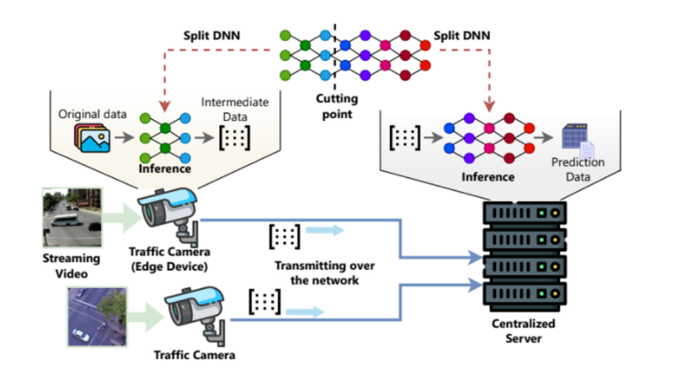
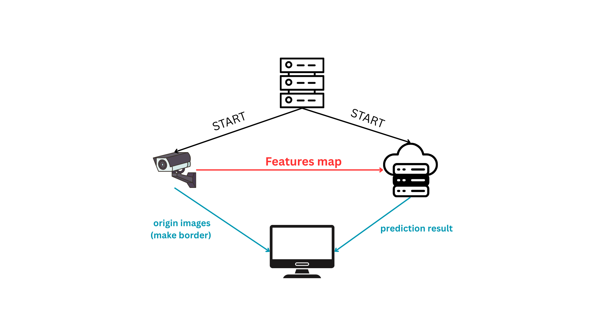

# Split Inference 

This project implements **Split Inference for YOLOv11** to enable real-time object detection on low-power **edge devices (Jetson Nano)** by dividing the neural network across multiple machines.



Instead of transmitting full video frames, the edge device runs the first part of the model (**head**) and sends only **intermediate feature maps** to a second client running the remaining layers (**tail**). A **server** manages the workflow, while a **tracker** visualizes results on a laptop display.

---

## Architecture

### Components

**Client 1 – Edge Device (YOLO Head)**  
- Captures video frames.  
- Runs the front layers of YOLOv11.  
- Sends compressed ( quantization) feature maps to the network.

**Client 2 – Tail Device (YOLO Tail)**  
- Receives feature maps.  
- Runs remaining layers.  
- Outputs detection results.

**Server – Controller**  
- Registers clients.
- Selects and manages cut-layers.
- Coordinates all messaging using RabbitMQ.

**Tracker – Viewer (Laptop)**  
- Displays bounding boxes and video frames received from the system (since Jetson Nano does not have a screen).

---

## Data Flow



---

## Project Structure

```

split_inference/
├── client.py          # Edge or tail inference node
├── server.py          # Central controller
├── tracker.py         # Video visualization
├── config.yaml        # Configuration file
├── requirements.txt   # Python dependencies
├── src/               # Core framework modules include partition 
└── output.csv         # Performance results

````

---

## Installation

### 1. Clone the repository

```bash
git clone https://github.com/filrg/split_inference
cd split_inference
````

---

### 2. Install dependencies

Python **3.9+** required.

```bash
pip install -r requirements.txt
```

---

### 3. Start RabbitMQ

RabbitMQ is required for message communication between devices.

```bash
sudo docker stop rabbitmq
sudo docker rm rabbitmq

sudo docker run -d \
  --name rabbitmq \
  -p 5672:5672 \
  -p 15672:15672 \
  rabbitmq:3-management
```

RabbitMQ admin UI:

```
http://localhost:15672
```

Default login:

```
username: guest
password: guest
```

---

## Configuration

Edit **config.yaml**:

```yaml
name: YOLO
server:
  cut-layer: a #or b, c, d
  clients:
    - 1
    - 1
  model: yolo11n
  batch-frame: 1
model: yolo11n
rabbit:
  address: 127.0.0.1    # if run on local 
  username: guest
  password: guest
#  address: "192.168.101.91"  # if run on server 
#  username: "dai"
#  password: "dai"
  virtual-host: /
  queue_device_1: "device1"
  queue_device_2: "device2"

data: video.mp4
log-path: .
control-count: 10
debug-mode: False
compress:
  enable: False
  num_bit: 8
cal_map:
  enable: False
  create_label: False

time_layer:
  num_round: 2
  input_shape: [1, 3, 640, 640]

partition:
  auto: True        # if set False then get [server][cut-layer]
  re-measure: False # if set False then get result from cut_point.log

```

---

## Running the System

### Step 1 – Start Server

```bash
python server.py
```

---

### Step 2 – Start Clients

**Client 1 – Edge Device**

```bash
python client.py --layer_id 1
```

Optional CPU mode:

```bash
python client.py --layer_id 1 --device cpu
```

---

**Client 2 – Tail Device**

```bash
python client.py --layer_id 2
```

---

### Step 3 – Start Tracker

```bash
python tracker.py
```

A display window will open showing:

* Original frames
* Bounding boxes
* Detection confidence and FPS

---

## Outputs

### Result File

```
output.csv
```

Contains:

* FPS
* Total inference time
* Communication delay
* Device utilization
* And more . 

---

### Sample Logs

```text
Start Inference
FPS input: 30
End Inference
All time: 156.95 s
Inference time: 152.65 s
Utilization: 97.26 %
```

---

## Automatic Partitioning (Optional)

Enable optimized splitting:

```yaml
partition:
  auto: True
  re-measure: True
```

The server will:

1. Benchmark inference time of all layers.
2. Measure communication overhead.
3. Build a cost graph.
4. Run **Dijkstra optimization** to select the most efficient cut-layer.

---

## Tested Hardware

| Device          | Role                   |
| --------------- | ---------------------- |
| Jetson Nano     | Client 1 (YOLO Head)   |
| Jetson Nano     | Client 2               |
| Laptop/Desktop  | Tracker                |
| LAN Network     | RabbitMQ communication |

---

## Application Scenarios

* Smart traffic monitoring
* Edge surveillance AI
* Multi-device inference research
* Network bandwidth reduction studies

---

## [License](./LICENSE)