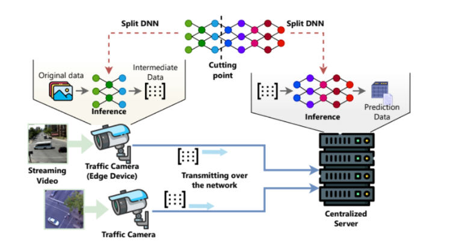
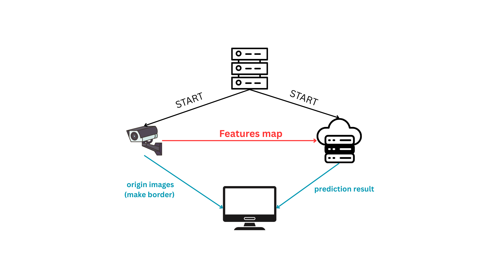

# Split Inference

This project implements **Split Inference for YOLOv11** to enable real-time object detection on low-power **edge devices (Jetson Nano)** by dividing the neural network across multiple machines.

Instead of transmitting full video frames, the edge device executes the first part of the model (**head**) and sends only **intermediate feature maps** to another device that runs the remaining layers (**tail**).

---

# Table of Contents

* [Overview](#overview)
* [Architecture](#architecture)
<!-- * [Data Flow](#data-flow) -->
* [Pipeline](#pipeline)
* [Project Structure](#project-structure)
* [How to Run](#how-to-run)

  * [Clone Repository](#1-clone-the-repository)
  * [Install Dependencies](#2-install-dependencies)
  * [Start RabbitMQ](#3-start-rabbitmq)
* [Configuration](#configuration)
* [Running the System](#running-the-system)
* [Automatic Partitioning](#automatic-partitioning)
* [Tested Hardware](#tested-hardware)
* [Application Scenarios](#application-scenarios)
* [License](#license)

---

# Overview

<p align="center">
  
</p>

In traditional edge AI pipelines, raw video frames are transmitted to a centralized server for processing. This creates high network bandwidth usage and latency.

**Split inference** solves this by dividing the neural network into two parts:

1. **Head (Edge Device)** – processes the early layers of the model.
2. **Tail (Server / Cloud)** – processes the remaining layers.

Only **intermediate feature maps** are transmitted instead of full images, reducing bandwidth and improving scalability.

---

# Architecture

The system consists of four main components.

## Stage 1 – Edge Device (Head)

Devices located at the edge such as **traffic cameras or embedded devices (Jetson Nano)**.

Responsibilities:

* Capture video frames
* Run the first layers of YOLOv11
* Compress intermediate feature maps using quantization
* Send feature maps to the network

---

## Stage 2 – Tail Device (Tail)

Devices located in the **cloud or high-performance servers**.

Responsibilities:

* Receive feature maps from edge devices
* Run the remaining layers of the neural network
* Produce final detection results

---

## Server – Controller

Central coordination service responsible for:

* Registering clients
* Selecting model cut-layers
* Managing inference workflow
* Coordinating communication using **RabbitMQ**


---
<!-- 
# Data Flow

<p align="center">
  
</p>

The system workflow:

1. Edge device captures video frames.
2. The head model processes early layers.
3. Intermediate **feature maps** are transmitted through the network.
4. Tail device completes the inference. -->

---

# Pipeline

<p align="center">
  
</p>

Pipeline steps:

1. Clients register with the server.
2. Server collects device information.
2. The model is split and inference begins.

---

# Project Structure

```
split_inference/
│
├── client.py          # Edge or tail inference node
├── server.py          # Central controller
├── config.yaml        # System configuration
├── requirements.txt   # Python dependencies
│
├── imgs/              # Images used in README
|   ├── overview.png
│   └── SI-Inference.jpg
│
├── src/               # Core framework modules
└── output.csv         # Performance results
```

---

# How to Run

## 1. Clone the repository

```bash
git clone https://github.com/filrg/split_inference
cd split_inference
```

---

## 2. Install dependencies

Python **3.8 or higher** is required.

```bash
pip install -r requirements.txt
```

---

## 3. Start RabbitMQ

RabbitMQ is used for communication between distributed components.

RabbitMQ admin interface:

```
http://localhost:15672
```

Default credentials:

```
username: guest
password: guest
```

---

# Configuration

Edit **config.yaml** before running the system.

Example configuration:

```yaml
name: YOLO
server:
  cut-layer: a # or b, c, d
  clients:
    - 1
    - 1
  model: yolo26n
  batch-size: 5
rabbit:
  address: 127.0.0.1
  username: guest
  password: guest
  virtual-host: /

debug-mode: False
data: videos/video.mp4
log-path: .
control-count: 1
compress:
  enable: True
  num_bit: 8
```

Feature map compression:

```yaml
compress:
  enable: True
  num_bit: 8
```

---

# Running the System

## Step 1 – Start Server

```bash
python server.py
```

---

## Step 2 – Start Clients

Edge device:

```bash
python client.py --layer_id 1
```

Optional CPU mode:

```bash
python client.py --layer_id 1 --device cpu
```

Tail device:

```bash
python client.py --layer_id 2
```

---

# Tested Hardware

| Device           | Role                   |
| ---------------- | ---------------------- |
| Jetson Nano      | Edge Client (Head)     |
| Jetson Nano      | Tail Client            |
| Laptop / Desktop | Tracker                |
| LAN Network      | RabbitMQ communication |

---

# Application Scenarios

* Smart traffic monitoring
* Edge surveillance AI
* Distributed deep learning research
* Bandwidth reduction experiments

---

# License

See [LICENSE](./LICENSE)
